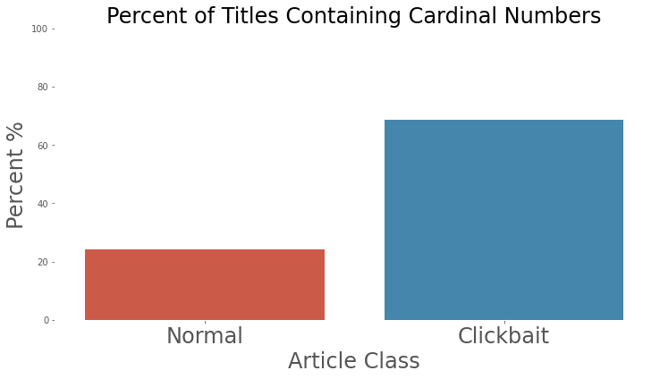
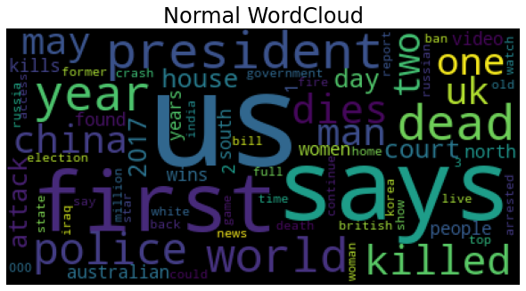
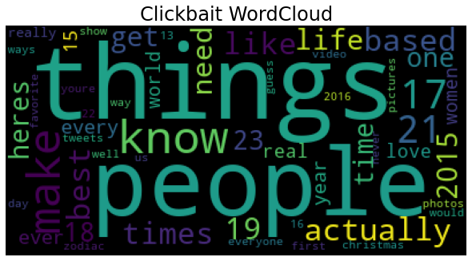
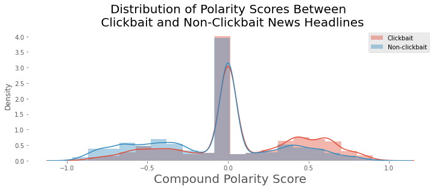
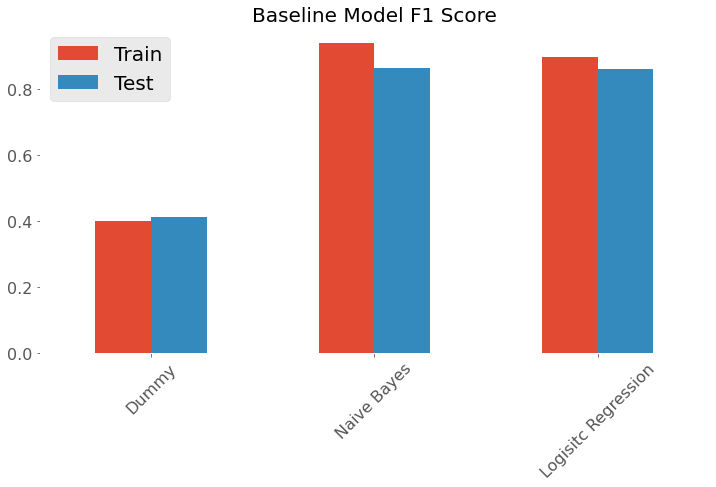
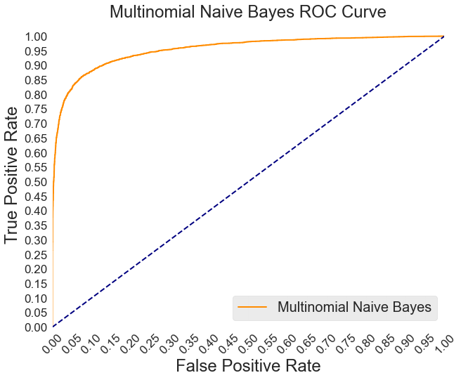
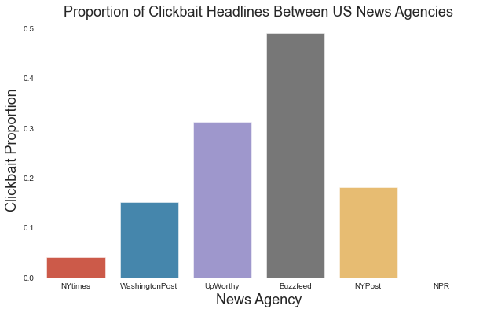

**Author**: [Tim Hintz](mailto:tjhintz@gmail.com)

# Bait 'n' Switch
## This One Simple Model has EVERY Marketing Firm Furious


### Overview
**KEY FINDINGS**
- Final model had an f1 of 0.88 on the combined testing data.
- One of the models had an f1 of 0.98 on the testing data using only one ofthe three data sets.
- Used the final model to create an API 
- Used the API to create a simple  webapp 


*A collection of all of the ROC-AUC curves of tested models. The simpler models performed better on this data set.*

## Business Case 

For this project, I assumed the mindset of a data scientist working for a small, yet competitive internet browser startup. The stakeholders are looking for an edge on the larger browsers by implementing some quality of life improvements. The executives have asked me to create an extension for the browser that will filter out `click-bait` from webpages.

The first step in the process was building the classifier. Using natural language processing on manually labelled datasets <sup>[1](#myfootnote1)</sup><sup>[2](#dataset2)</sup><sup>[3](#dataset3)</sup> , I was able to produce a statistical model that could predict click bait with close to 90% accuracy (0.88 f1 score).

The next step was host the model as an API on a server which I did using flask, gunicorn and heroku as the host.

Finally, I am building a browser extension. The current plan is to have the the extension make calls to the API on mouse over and return a red, yellow or green flas depending on the click bait content of the linked URL. 


### Context
> "While we can't blame all attention distraction on click bait,
> as with any addictive relationship,
> it is an enabler."
- Gloria Mark is a professor specializing in human-computer interactions at the University of California, Irvine.

Clickbait can be defined as a headline or hyperlink that is intentionally designed to grab 
readers attention and are typically sensationalist or misleading. The superficial consequences of clickbait are the erosion of trust in the webpage or a perceived lack of credibility of a news source. For businesses built on an economy of clicks, where the more views a page gets, the more the business can charge their advertisers, click bait is a natural design evolution. However, now that this style of heading is pervasive in social media and in news agencies, the ability for malicious actors to add false information into headlines is becoming easier. Detecting fake news directly is difficult, but click bait sensationalism can act as a proxy for fake news articles . Therefore, I wanted to create a feed-back loop that penalizes news agencies for producing clickbait and frees up the user’s web browsing experience.

Reducing the amount of clickbait from the browsing experience has two major advantages for the browser of choice: 
The reduction in click bait will likely increase the usage of the browser due to the reduced cognitive load brought about by information overload.
Removing click bait from the browser will aid in the protection non-tech natives from accessing or spreading false information  

Internet privacy and data integrity are the foremost issues in big tech. By adding a feature that protects users from the spread of fake news while simultaneously boosting usership on the browsing platform is an absolute win. The benefit of providing a negative feed-back loop to news agencies who have built their empire around sensationalism is just gravy. 

### The Data

#### Dataset 1
 - From Chakraborty et al., 2016 "Stop Clickbait: Detecting and preventing clickbaits in online news media" <sup>[1](#dataset1)</sup>
 - 32,000 news headlines, 16,000 clickbait and 16,000 non-clickbait articles
 -  The clickbait corpus consists of article headlines from ‘BuzzFeed’, ‘Upworthy’, ‘ViralNova’, ‘Thatscoop’, ‘Scoopwhoop’ and ‘ViralStories’. The non-clickbait article headlines are collected from ‘WikiNews’, ’New York Times’, ‘The Guardian’, and ‘The Hindu’.
 - Data was manually labelled, 3 labellers and the majority was taken as truth

#### Dataset 2
- The Webis Clickbait Corpus 2016 (Webis-Clickbait-16) comprises 2992 Twitter tweets sampled from top 20 news publishers as per retweets in 2014 <sup>[2](#dataset2)</sup>.
-  Data was manually labelled by 5 labellers on a scale of 1 to 5 and the mean was taken as truth.
- A total of 767 tweets are considered clickbait by the majority of annotators and 2225 where classified as normal
- The dataset contains the raw tweets containing urls. The urls are links to news headlines. I used those urls as tests for the model. 

#### Dataset 3

- The Webis Clickbait Corpus 2017 (Webis-Clickbait-17) comprises a total of 38,517 Twitter posts from 27 major US news publishers <sup>[3](#dataset3)</sup>. 
- All posts were annotated on a 4-point scale: not click baiting (0.0), slightly click baiting (0.33), considerably click baiting (0.66), heavily click baiting (1.0) by five annotators from Amazon Mechanical Turk
- 9,276 posts are considered clickbait by the majority of annotators and 29,241 where considered normal


The Final model was combination of datasets 1 and 3. Dataset 2 was only twitter posts which were too different to news headlines to include into the model.


### Exploratory Data Analysis

I didn't realize how unconventional this project was going to be. It was my first NLP project and I had learnt somethings were important:
- Stem and lemmetise your corpus
- remove stopwords

It turned out that both stemming/lemmetizing and removing stopwords damaged my models predictability. This threw me initially, however, I imbraced the oddity as a feature of the dataset and persued the line of inquiry.

**Presence of Cardinality**



70% of all clickbait articles in my corpus contained cardinal numbers. This made a lot of sense to me. The number of "listicles" online are growing. In addition, there are the "17 surprising facts about bald eagles you should know" type headlines.

**Presence of Stopwords**


This was more surprising. Clickbait tends to have 20% more stopwords in each title than normal headlines. Rather than being a hinderence to the model, in this instance, stopwords were actually a feature.


**Difference in Sentiment/Tone**

I wanted a qualitative sense of the vocabularies to motivate further analysis. Headlines are supposed to be sentiment neutral, however looking at the normal headline word cloud versus clickbait, we definitely see differences in overall tone which is reflected by the near mirror image sentiment polarity scores between the classes.

Non-Clickbait WordCloud           |  Clickbait WordCloud
:-------------------------:|:-------------------------:
 | 



I believed I could leverage these class disparities using a Bag of Words approach. A Bag of Words is where you treat the words themselves as the features of the model. If the corpus is large enough, a bag of words approach is capable of capturing almost all of the features in corpus<sup>[5](The Unreasonable Effectiveness of Data)</sup>. You then look at the corpus statistics. For instance, how many times does the word "frequency" appear in corpus. You can then take that and ask how many times frequency occurs in each class and you begin to get a sense of which words are more common to subclasses. For this study, I used Term Frequency-Inverse Document Frequency (Tf-idf) which is simply the number of times a word appears within a document weighted by the inverse of frequency of documents that word appears in within the corpus. 

The Disadvantage to bag of words is that during tokenization, you produce as many features as there are words. If you increase the n_gram range, which is the number of successive words that can be linked together into a token, you can create truly enormous matrices. 

My matrix that I used had over 50k rows and over 300k columns so it was very important that I use a statistical model that can evaluate quickly. To that end, I decdied to use Naive Bayes and Logistic Regression. I did try other models, SVM, random forest, XGboost, but none were as good in the current contexct as naive bayes.

### The Model
I tried a variety of models but only two satisfied the business need of being light weight and fast as well as performing well on my performance metrics:
- `Logistic Regression`
- `Multinomial Naive Bayes`


### Evaluation


My baselines were all in the low to mid 80's for f1 score. Compared to the dummy classifier set to "most frequent" where it simply guesses the dominant class everytime. I was able to increase that number to 0.88 using cross validation and adjusting the categorical smoothing (Laplace Smoothing).



I decided that I was unable to improve on this model on this dataset. If I were to exclude all of that data from dataset 3 I would have acheived an f1 score of 0.98 on the testing data. However, I wanted to expose my model to as much information as possible. It is a weaker model over all but hopefully will show less variance when it comes to putting the model into production.


### Discussion and next steps

For my next steps, I would like to improve this model. Though I do have a strong, MVP its performance may not be good enough to put into production. One in ten misclassifications is potentially too high. We see upwards of hundreds of headlines everyday and we would notice a misclassification of a few dozen. To that end, I want to Explore alternative modeling techniques like feature unions. Feature unions are similar to a voting classifer but they combine the output of one model with a collection of engineered features. Features unions have been very successful in combining sparse and non sparse data together which is my exact usecase.

I may be able to improve the model further by reducing noise produced from the Webis dataset. The issue with the webis data set is that they used hard voting. This means that if the subjective "mean" score of a particular headline is less than 0.5 (as low as 0.4 in the case of the present data set) but the mode was 0.66 (ie in the case of 5 voters [0,0,0.66,0.66,0.66], that headline was labelled as clickbait. I disagree with that methodology. The entire point of using a likert scale is to gain a more precise subjective evaluation. If you are going to reduce the voting to hard voting, you may as well have binarized the problem and asked a simple dichotomous question.

Further more, I will ontinue testing the model out on real websites and make sure that the false negatives and false positives aren’t glaring. When I Deploy the model I would like to set up a method for active learning whereby users can help train and personalize the filter to their own preferences.

#### An example of my model running on some popular US news websites:


*This model behaves as we would expect and could be a useful reminder for people to keep their gaurd up when entering a clickbaity news site*

### How to

You can use the application at https://baitnswitch.herokuapp.com.  If you enter a headline, the model will tell you whether or not that headline has a greater than 50% chance of being clickbait (likely or not). I could imagine this being a usefull tool for Journalists to practice high integrity writing. 

If you submit a full url (include *http..*), the model will return the proportion of headlines in that url that are likely to be clickbait. This feature is what I hope to utlize to create a chrome extension. 


#### API 
You can send POST requests containing either a url or a headline to https://baitnswitch.herokuapp.com/apiendpoint. If you send a headline, it will return the a json object containing somne metadata as well as all headlines scraped from the website and an array of index matched predictions of those headlines. 

endpoint: https://baitnswitch.herokuapp.com/apiendpoint
POST data: "headline"

note that baitnswitch will automatically parse the a url if you enter one. If you do not enter a url, the baitnswitch will treat whatever you entered as a news headline and will return the probability as plaintext that it is clickbait.

I invite you to use the API endpoint. Fair warning, it is hosted on a heroku server and they may throttle access so I sugggest waiting between calls to avoid failed POST requests. 

### Repository Structure
```
.
├── README.md
├── app.py <- Flask application backend API for chrome extension
├── templates <- HTML templates for flask application
├── static <- CSS and images for flask application
├── requirements.txt <- Flask application backend API for chrome extension
├── slideDeck.pdf <- Capstone presentation slide Deck
├── bait-n-switch.ipynb <- Project Walkthrough
├── baitnswitch <- Chrome Extension (WIP)
├── notebooks 
│   ├── EDA <- Exploration of the data and dataset creation
│   └── modelling <- Experiemental modelling techniques
└── src
    ├── data <- Raw and processed data 
    ├── images <- images generated within the project
    ├── models <- Where the models will save if you clone and run this repo
    └── modules <- .py files
```
### References
- <a name="dataset1">[1]</a>: Abhijnan Chakraborty, Bhargavi Paranjape, Sourya Kakarla, and Niloy Ganguly. "Stop Clickbait: Detecting and Preventing Clickbaits in Online News Media”. In Proceedings of the 2016 IEEE/ACM International Conference on Advances in Social Networks Analysis and Mining (ASONAM), San Fransisco, US, August 2016.
- <a name="dataset2">[2]</a>:  Potthast, Martin, Stein, Benno, Hagen, Matthias, & Köpsel, Sebastian. (2016). Webis Clickbait Corpus 2016 (Webis-Clickbait-16) [Data set]. Presented at the 38th European Conference on IR Research (ECIR 2016), Zenodo.
- <a name="dataset3">[3]</a>: Potthast, Martin, Gollub, Tim, Wiegmann, Matti, Stein, Benno, Hagen, Matthias, Komlossy, Kristof, … Fernandez, Erika P. Garces. (2018). Webis Clickbait Corpus 2017 (Webis-Clickbait-17) [Data set].
- <a name="dataset2">[4]</a>: Bird, Steven, Edward Loper and Ewan Klein (2009), Natural Language Processing with Python. O’Reilly Media Inc.
- <a name="The Unreasonable Effectiveness of Data">[5]</a>: [The Unreasonable Effectiveness of Data](https://static.googleusercontent.com/media/research.google.com/en//pubs/archive/35179.pdf)
